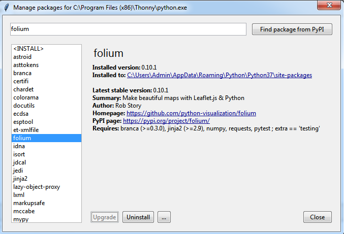

# Installation

L'installation est très simple et peut se faire sous Linux, Windows ou Mac

* Allez sur [https://thonny.org/](https://thonny.org/) pour télécharger thonny

* Une [vidéo en français](https://youtu.be/BGn-VMk7vvc?list=PLxZl6Qtaf2ewu_F15Xp4bH_yy2GVyOgO9) sur l'installation et la présentation de l'environnement de Thonny

**Remarque :** Je vous conseille de choisir "english" lors de l'installation, le français étant pour l'instant en version Beta au moment où j'écris ce texte

# Utilisation du mode pas à pas

Lorsqu'un programme ne fonctionne pas comme vous le voulez et que vous ne trouvez pas le problème, il faut penser à utiliser le mode à pas  
[Vidéo d'explication](https://youtu.be/nwIgxrXP-X4) (en anglais)

# Installation de modules en python

> Remarque : Il se peut que vous ayez déjà python installé sur votre machine. Il faut savoir que Thonny est complètement indépendant de toute autre installation python. Il en va de même pour les modules : Pour utiliser un module dans Thonny, il faut qu'il soit installé dans Thonny même si ce module a déjà été installé sur votre machine

1. Allez dans le menu **Tools** puis cliquer sur **Manage packages**  

2. Dans la partie de gauche apparaît les modules installés dans Thonny, si le module que vous souhaité n'y apparaît pas, il faut l'installer.  
Pour cela, tappez le nom de votre module (par exemple ici "folium", un module permettant de faire de la cartographie), puis cliquez sur **find package fom PyPi**  

3. La fenêtre suivante vous montre le module trouvé par Thonny. Assurez-vous que c'est bien celui que vous voulez installer puis cliquez sur **Install**  

4. Le téléchargement du module se fait depuis le site [https://pypi.org/](https://pypi.org/). A la fin de celui-ci, le module se retrouve dans la partie de gauche.  
Vous pouvez donc l'utiliser dans vos programme (grâce à la directive `import`). Cliquez sur **close**  

